#              实验三：Docker基础实验

### 一.安装Docker

####         先决条件：

- #### 已安装CentOS 7，并且内核版本大等于3.10

- #### 非root用户已获得sudo特权。

  1.使用如下命令查看操作系统内核信息：

​              uname -r

​         结果如图所示：

 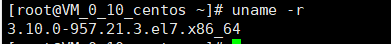

​        2.顺带看一下Linux的版本号：

​              cat /etc/redhat-release

​            结果如图所示：

   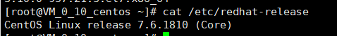

####           安装Docker

​        添加Docker的官方仓库，下载最新的Docker并安装：

​             curl -fsSL https://get.docker.com/ | sh

​        安装完成之后启动Docker守护进程，即Docker服务：

​              sudo systemctl start docker

​         验证Docker是否成功启动：

​                sudo systemctl status docker

​          得到类似如下图的输出：

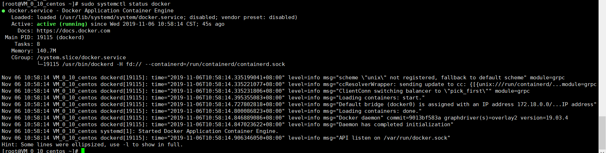

​           最后，确保Docker当服务器启动时自启动：

​                 sudo systemctl enable docker

​           此外，还可以查看一下Docker的版本信息：

​                  docker version

​          输出如图：

​            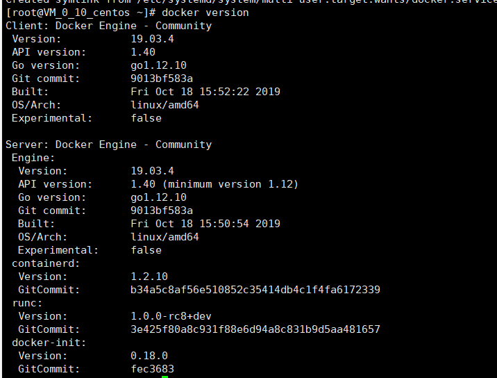

### 二.Docker加载镜像

1.拉取CentOS 7的镜像

​        docker pull centos:7

2.查看一下当前系统中存在的镜像：

​        docker images

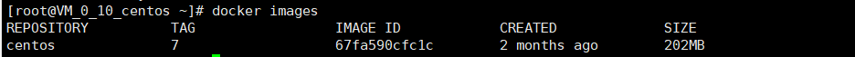

3.运行Docker容器（为了方便检测后续wordpress搭建是否成功，需设置端口映射（-p），将容器端口80 映射到主机端口8080，Apache和MySQL需要 systemctl 管理服务启动，需要加上参数 --privileged 来增加权，并且不能使用默认的bash，换成 init，否则会提示 Failed to get D-Bus connection: Operation not permitted ，，-name 容器名  ，命令如下 ）*

​      docker run -d -it --privileged --name wordpress -p 8080:80 -d centos:7 /usr/sbin/init

4.查看启动的容器

​     docker ps 

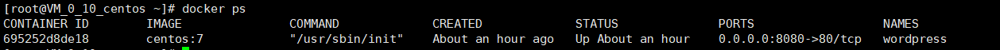

5.进入容器，如下图所示：

  docker exec -it 695 /bin/bash

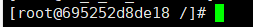

### 三.在容器内安装wordpress

详见实验二 [在CentOS上安装Wordpress](https://github.com/zhengjianjian/cloud-computing/tree/master/Website)

最终在8080端口下搭建wordpress成功，如下图

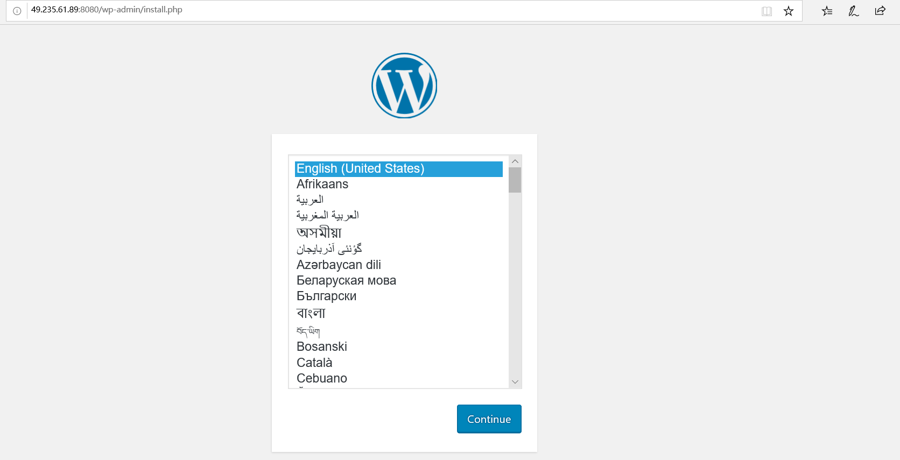

### 四.推送带有wordpress的镜像

***前往***[docker hub](https://hub.docker.com/)注册账号，下面需要用到。

将容器生成镜像  (所生成的镜像名由   “Docker用户名/Docker仓库名“组成 )

docker commit -a "Docker用户名" -m "提交描述" 容器id 镜像名:tag标签

举例：docker commit -a "1448166956" -m "wordpress on centos7" 695252d8de18 1448166956/centos7:a1

显示生成的镜像，如下图：

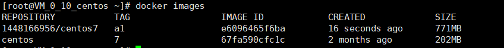

登录docker

docker login

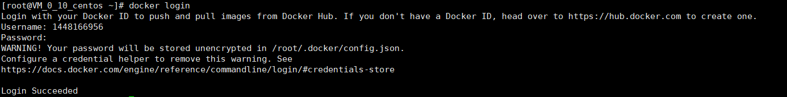

推送镜像

docker push 1448166956/centos7:a1

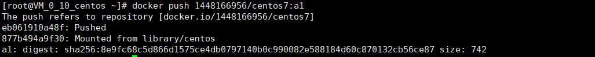

用网站登录Docker查看仓库

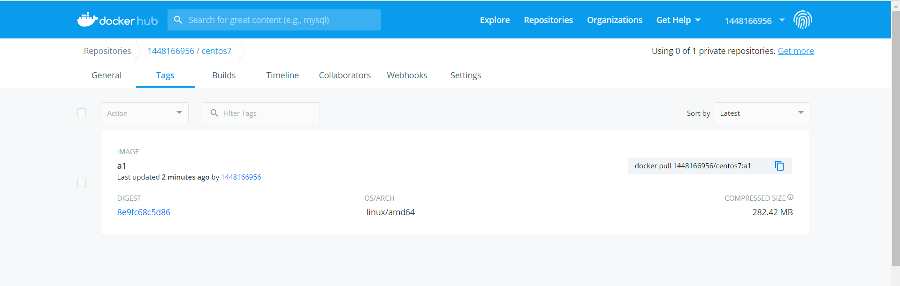

### 三.编写Dockerfile

1.编写Dockerfile安装Apache web服务器

(1)在本地主机新建一个目录（本文为mydocker）存放Dockerfile文件，新建Dockerfile文件：

 mkdir mydocker

 cd mydocker

 vim Dockerfile

向Dockerfile文件中添加如下内容.

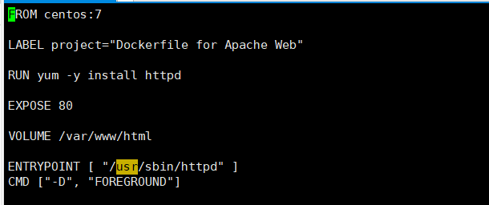

(2)生成Docker镜像

docker build  -t centos:httpd .

结果如下：

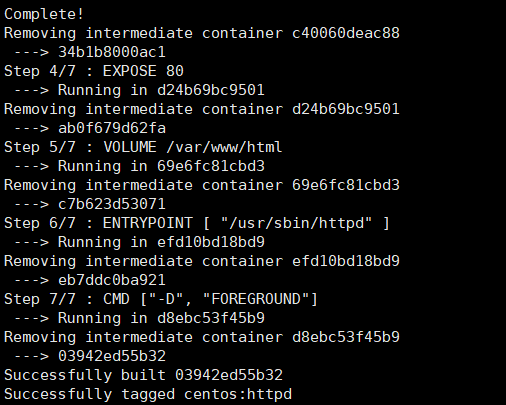

(3)启动容器实例

首先，为刚才在Dockerfile中VOLUME创建挂载点。在本地主机下创建一个新目录（/data目录），用于挂载Apache Web的根目录/var/www/html，对应Dockerfile文件中定义的“VOLUME /var/www/html”。

mkdir data

随后，启动容器

docker run -td -p 8888:80 -v /data:/var/www/html --name=web centos:httpd

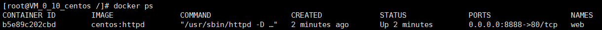

（4）验证apache web服务器是否安装成功

​    在/data目录创建index.html文件，由于刚才设定了卷的挂载，index.html将自动挂载到容器的/var/www/html目录，而这个目录是Apache Web的根目录。

  cd data

vim index.html

添加如下内容：

This is an apache httpd test. Build with dockerfile on CentOS 7.
Data are on host but share with volumn /var/www/html on the Docker container.
进入相关端口，得到结果：

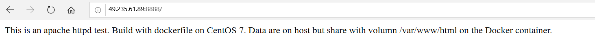

2.编写Dockerfile安装php服务器

(1)安装php服务器是在安装好的有apache web服务器的容器

   cd mydocker

   vim Dockerfile

向Dockerfile文件中添加如下内容.

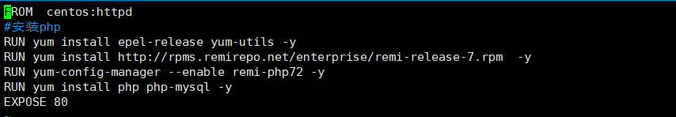

(2)生成Docker镜像

docker build  -t centos:php .

结果如下：

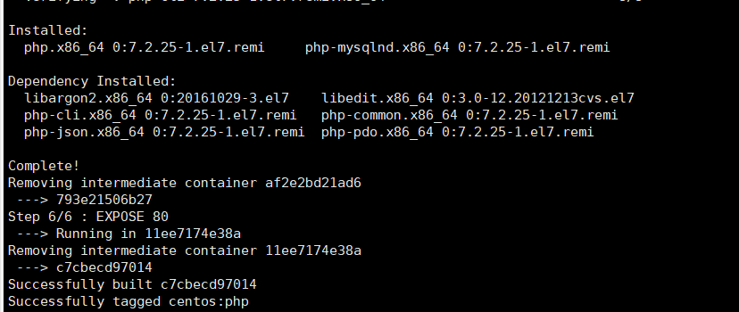

(3)启动容器实例

首先，为刚才在Dockerfile中VOLUME创建挂载点。在本地主机下创建一个新目录（/data目录），用于挂载Apache Web的根目录/var/www/html，对应Dockerfile文件中定义的“VOLUME /var/www/html”。

mkdir data

随后，启动容器

docker run -td -p 8889:80 -v /data:/var/www/html --name=php centos:php

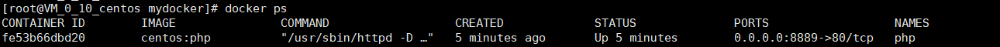

（4）验证php服务器是否安装成功

在/data目录下创建info.php,内容如下：

<?php phpinfo(); ?>

进入相关端口，查看结果

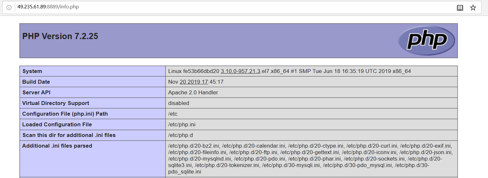

3.安装WordPress

(1)安装wordpress是在安装好的有php服务器的容器

 cd mydocker

   vim Dockerfile

向Dockerfile文件中添加如下内容.

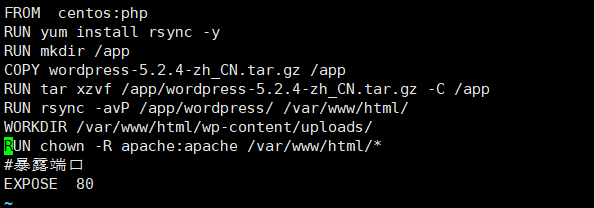

(2)生成Docker镜像

docker build  -t centos:wordpress1 .

结果如下：

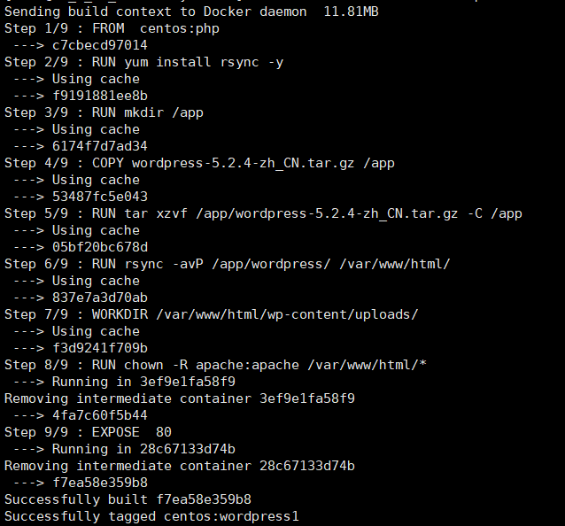

