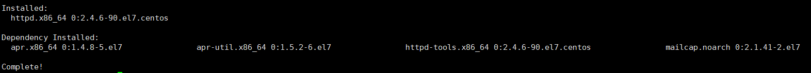
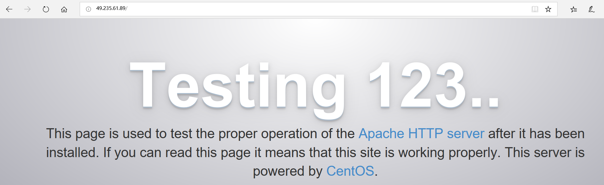
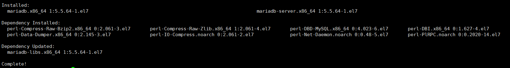
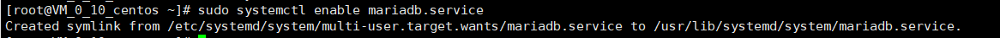
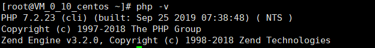
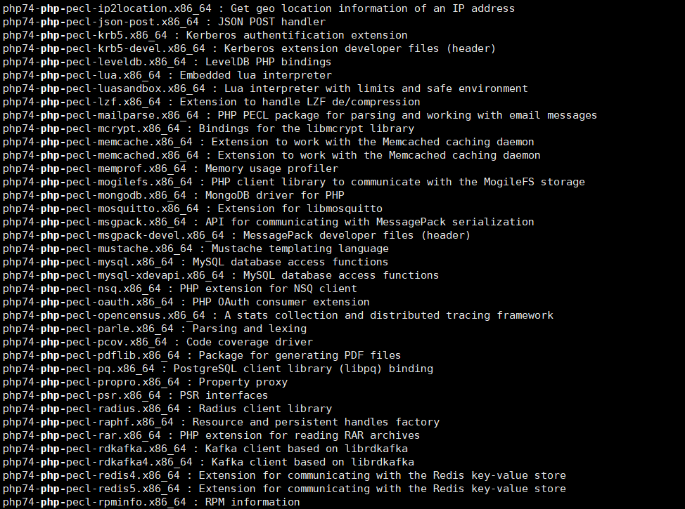

#                  实验二 腾讯云创建个人网站

### 1.安装Apache Web服务器

  使用yum工具安装：

启动Apache Web服务器：

sudo systemctl start httpd.service

测试Apache服务器是否成功运行，在浏览器输入：

http://49.235.61.89/

若运行正常，将出现如下界面：

### 2.安装MYSQL

安装MariaDB:

sudo yum install mariadb-server mariadb

安装完成显示

安装好之后，启动mariadb:

sudo systemctl start mariadb

运行简单的安全脚本以移除潜在的安全风险，启动交互脚本：

sudo mysql_secure_installation

设置相应的root访问密码以及相关的设置

最后设置开机启动MariaDB:

sudo systemctl enable mariadb.service

### 3.安装PHP

首先启动这两个仓库

sudo yum install epel-release yum-utils

sudo yum install http://rpms.remirepo.net/enterprise/remi-release-7.rpm

接着启用PHP 7.2 Remi仓库：

sudo yum-config-manager --enable remi-php72

安装PHP以及php-mysql

sudo yum install php php-mysql

查看安装的php版本：

php -v

安装之后，重启Apache服务器以支持PHP:

sudo systemctl restart httpd.service

### 安装PHP模块

如下命令可以查看可用模块：

yum search php-

部分结果如图所示：

