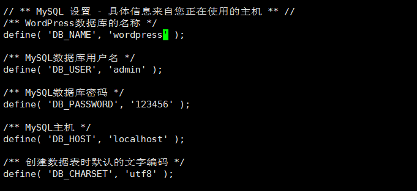

#                  实验二 腾讯云创建个人网站

### 1.安装Apache Web服务器

  使用yum工具安装：

启动Apache Web服务器：

sudo systemctl start httpd.service

测试Apache服务器是否成功运行，在浏览器输入：

http://49.235.61.89/

若运行正常，将出现如下界面：

### 2.安装MYSQL

安装MariaDB:

sudo yum install mariadb-server mariadb

安装完成显示

安装好之后，启动mariadb:

sudo systemctl start mariadb

运行简单的安全脚本以移除潜在的安全风险，启动交互脚本：

sudo mysql_secure_installation

设置相应的root访问密码以及相关的设置

最后设置开机启动MariaDB:

sudo systemctl enable mariadb.service

### 3.安装PHP

首先启动这两个仓库

sudo yum install epel-release yum-utils

sudo yum install http://rpms.remirepo.net/enterprise/remi-release-7.rpm

接着启用PHP 7.2 Remi仓库：

sudo yum-config-manager --enable remi-php72

安装PHP以及php-mysql

sudo yum install php php-mysql

查看安装的php版本：

php -v

安装之后，重启Apache服务器以支持PHP:

sudo systemctl restart httpd.service

### 安装PHP模块

如下命令可以查看可用模块：

yum search php-

部分结果如图所示：

这里先行安装php-fpm(PHP FastCGI Process Manager)和php-gd(A module for PHP applications for using the gd graphics library)，WordPress使用php-gd进行图片的缩放。

sudo yum install php-fpm php-gd

### 4.测试PHP

这里我们利用一个简单的信息显示页面（info.php）测试PHP。创建info.php并将其置于Web服务的根目录

sudo vim /var/www/html/info.php

该命令使用vim在/var/www/html/处创建一个空白文件info.php，我们添加如下内容：

<?php phpinfo(); ?>

完成之后，使用刚才获取的cvm的IP地址，在本地主机的浏览器中输入:

http://49.235.61.89/info.php

即可看到如下界面：

### 5.安装WordPress以及完成相关配置

#### （1）为WordPress创建一个MySQL数据库

​     首先以root用户登录MySQL数据库：

​      mysql -u root -p

​    键入之前设置的root用户密码，并按下回车键进入MySQL命令行模式。

首先为WordPress创建一个新的数据库：

CREATE DATABASE wordpress;

接着为WordPress创建一个独立的MySQL用户：

CREATE USER admin@localhost IDENTIFIED BY '123456';

授权给wordpressuser用户访问数据库的权限：

授权给wordpressuser用户访问数据库的权限：

GRANT ALL PRIVILEGES ON wordpress.* TO admin@localhost IDENTIFIED BY '123456';

随后刷新MySQL的权限：

FLUSH PRIVILEGES;

最后，退出MySQL的命令行模式：

exit;

### (2)安装WordPress

下载WordPress至当前用户的主目录：

wget命令从WordPress官方网站下载最新的WordPress集成压缩包，解压该文件：

解压之后在主目录下产生一个wordpress文件夹。我们将该文件夹下的内容同步到Apache服务器的根目录下，使得wordpress的内容能够被访问。这里使用rsync命令：

sudo rsync -avP ~/wordpress/ /var/www/html/

接着在Apache服务器目录下为wordpress创建一个文件夹来保存上传的文件：

mkdir /var/www/html/wp-content/uploads

对Apache服务器的目录以及wordpress相关文件夹设置访问权限：

sudo chown -R apache:apache /var/www/html/*

这样Apache Web服务器能够创建、更改WordPress相关文件，同时我们也能够上传文件。

### （3）配置WordPress

大多数的WordPress配置可以通过其Web页面完成，但首先通过命令行连接WordPress和MySQL。
定位到wordpress所在文件夹：

WordPress的配置依赖于wp-config.php文件，当前该文件夹下并没有该文件，我们通过拷贝wp-config-sample.php文件来生成：

cp wp-config-sample.php wp-config.php

然后，通过nano超简单文本编辑器来修改配置，主要是MySQL相关配置：

nano wp-config.php

将文件中的DB_NAME，DB_USER和DB_PASSWORD更改成之前为WordPress创建的数据库的相关信息，这三处信息是当前唯一需要修改的。

### (4)通过Web界面进一步配置WordPress

经过上述的安装和配置，WordPress运行的相关组件已经就绪，接下来通过WordPress提供的Web页面进一步配置。输入你的IP地址或者域名：

http://49.235.61.89/

出现如下界面：

设置网站的标题，用户名和密码以及电子邮件等，点击**Install WordPress**，弹出确认页面：

点击**Log In**，弹出登录界面：

输入用户名和密码之后，进入WordPress的控制面板：

