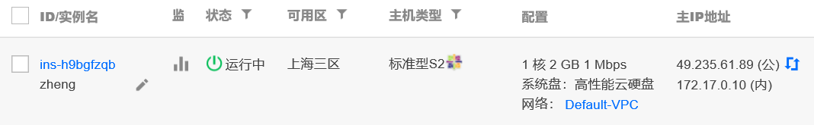

#                              实验一

### 1.购买腾讯云服务器，使用web shell登录，并使用xshell登录。

（1）购买腾讯云服务器

(2)使用web shell登录

(3)在xshell中登录云服务器。

### 2.创建GitHub项目并在本地同步

（1）安装Git bash

(2)验证是否存在ssh keys

(3)在github网站上添加ssh keys

(4)测试SSH key是否配置成功

(5)访问Github网站并新建代码仓库

(6)初始化本地文件夹作为一个Git仓库：

(7)添加远程代码仓库的URL：

(8)验证一下添加是否成功：

(9)从远程代码仓库拉取数据

(10)添加文件夹中的所有文件

(11)提交文件：

（12）推送本地更新至远程服务器：

### 本地安装VMware Workstation和Centos操作系统

